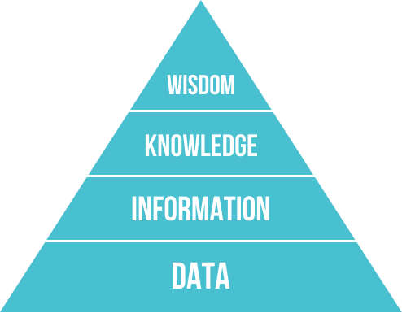

# A Primer on Data Science in Julia

> The key word in data science is not “data”; it is “science”.
>
> \- [Jeff Leek, simplystatistics.org](https://simplystatistics.org/2013/12/12/the-key-word-in-data-science-is-not-data-it-is-science/)

# What is Data Science?

The term **data science** is a relatively new term used to describe a variety of cross-discipline tasks that cover statistics, mathematics, computer science, data visualization, and information science.  Because of the wide variety of tasks involved, the role of a "data scientist" may differ greatly from business to business (or even within a single company).  At a high level, data science is the collection of activities that help one move upword in the [DIKW Pyramid](https://en.wikipedia.org/wiki/DIKW_pyramid), shown below:

**How do we get from data to knowledge/wisdom?**

Movement up the pyramid happens in incremental steps.  Sometimes you'll have an "aha!" moment and make a leap in understanding, but that is typically due to the previous information you've gathered.  To aid with the task of incremental knowledge-building, the data science workflow is made up of the following steps:

1. **Define** Your Objective
2. **Explore** Your Data
3. **Model** Your Data
4. **Evaluate** Your Model
5. **Communicate** Your Results

# Course Objectives

After taking this course, you will be able to

- Load data into Julia/save data to disk
- Explore the data with descriptive statistics
- Create common data visualizations
- Use a variety of data science-focused Julia packages, including **`Statistics`**, **`StatsBase`**, **`RDatasets`**, **`DataFrames`**, **`JuliaDB`**, **`Plots`**/**`StatsPlots`**, **`AverageShiftedHistograms`**, **`KernelDensity`**, and more.
