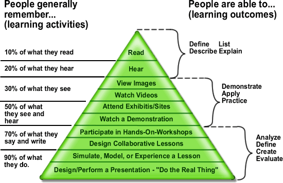
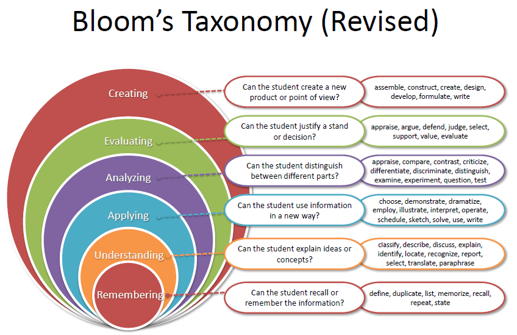

# Pedagogy 101

Your content is the most important thing, but that's where you're already an
expert. What makes or breaks your content is its structure and delivery. That's
where learning a few pedagogical principles will go a long way to making your
course stand out as an excellent resource for learning. This material here is
largely adapted from a teaching workshop for new engineering faculty led by Dr.
Jerry Samples, University of Pittsburgh.

## Understanding how we learn

Edgar Dale's "cone of learning" (or experience) is oftentimes chided as being
overly rigid or simplistic or not based in reality at all—just look at those
nice even percentages—but I find the overall concepts worth discussing. In
general, education researchers seem to agree that active learning tends to be
both more engaging and more effective.

Here at JuliaAcademy we have a more limited number of pathways to learning:

* Reading text with images (like this). Emphasis on images! Not just plots, but cartoons and diagrams.
* Watching a "normal" lecture, with traditional powerpoint-esque slides and audio
* Video demonstration, walking through (parts of a) tutorial notebook
* Hands-on independent work with a guided interactive tutorial notebook
* Hands-on independent work through a graded notebook

All of these are important pathways towards learning, and a mix of all of them
will provide variety, interest, and a level of robustness in the content for
all varieties of learners.

## Designing learning objectives

A good course will have both overall learning objectives as well as individual
objectives for each lecture. Bloom's taxonomy can give you a good sense of how
to write these objectives. I think we — as scientists and engineers — tend to
work through curriculum from the ground up with an iterative, brute force
sequence. It needn't be that way, and keeping these different levels of
educational difficulty in mind can help you get there. Even this needn't be
done in sequence (that is, higher level learning objectives do not need to
follow the lower level ones). In fact, it's often advantageous to have multiple
objectives from different levels of skill _within the very same lecture_.

To forumate your learning objectives, begin with a description of what you
expect students to be able to do after completing the course or lecture. Each
lecture should complement the overall course objectives.

## Developing  course and lecture outlines

Begin with the overall learning goals for your course and identify the discrete
topics that are required to acheive those goals. Break it down further into
individual lectures that will get a student to that goal. Structure each
lecture such that it has two to four learning objectives. Finally, when you go
to develop your lectures, tell the students up front what you're expecting them
to learn.

## Improving  presentation skills

Selected excerpts from _Teaching Engineering_, by Wankat and Oreovicz:

> "A professor's voice is indispensible in lecturing"

> "**Variety is the key**. Change the tone, pace, volume, pitch, inflection,
> and expressiveness of your voice. A flat, unvarying monotone puts students to
> sleep, and sleeping students cannot be learning."

> "The biggest difficulty in using the ~~chalkboard~~ computer is the loss of
> eye contact while ~~writing on the board~~ typing and running code"

Ok, this one doesn't seem like it's quite as applicable, but it really is!
Looking directly into the camera. While it feels strange, is a great way to
foster a rapport with your virtual students.

Don't rush. Students can fast-forward, go double speed, etc., but they cannot
dynamically ask you to slow down. Take your time and explain the concepts you
want as you want them.

I'd even encourage students to pause the videos to work out problems as a way
to get them to do more interactive hands-on learning.

Use notes — or even a script! If you find yourself stammering or stuttering,
taking the time to write out what you want to say ahead of time can help you
look calm, collected, and professional.
